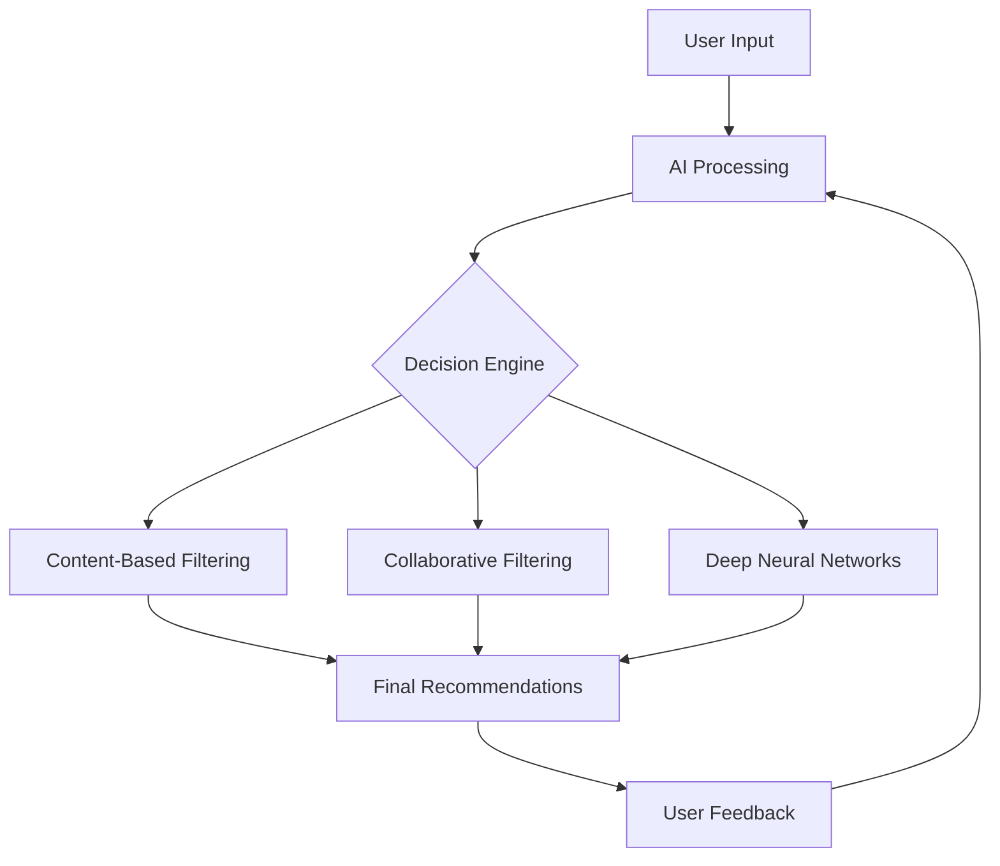

# 🤖🎬 AI-Powered Movies Recommendation System 🍿🧠


---


## 🚀 About the Project

Welcome to the future of movie recommendations! Our **AI-Powered Movies Recommendation System** harnesses the power of cutting-edge artificial intelligence to revolutionize your film-watching experience. Using advanced neural networks and machine learning algorithms, our system analyzes your viewing history, preferences, and even subtle patterns to suggest films that resonate with your unique taste.


### 🧠 AI Technologies Used


## ✨ AI-Powered Features

- 🤖 **Intelligent Personalization**: Our AI adapts to your preferences over time, continuously improving its recommendations.
- 🔮 **Predictive Analysis**: Anticipates trending movies you're likely to enjoy before they hit mainstream popularity.
- 🎭 **Emotion-Based Suggestions**: Analyzes movie sentiment to match recommendations with your current mood.
- 🌐 **Cross-Platform Learning**: Syncs your preferences across devices for a seamless experience.
- 🗣️ **Natural Language Interaction**: Ask for recommendations using everyday language.
- 🎨 **Visual Style Matching**: Suggests movies with similar visual aesthetics to your favorites.


## 💻 How It Works



## 🚀 Getting Started

1. **Clone the AI engine:**
   ```bash
   git clone https://github.com/your-username/ai-movies-recommendation-system.git
   ```

2. **Install AI dependencies:**
   ```bash
   pip install -r requirements.txt
   ```

3. **Train the AI model:**
   ```bash
   python train_ai_model.py
   ```

4. **Launch the recommendation engine:**
   ```bash
   python ai_recommender.py
   ```


## 💡 AI Model Usage Example

```python
from ai_movie_recommender import AIMovieRecommender

recommender = AIMovieRecommender()
user_id = 12345
mood = "excited"
recommendations = recommender.get_ai_recommendations(user_id, mood)

print("Top 5 AI-powered movie recommendations for your current mood:")
for movie in recommendations[:5]:
    print(f"- {movie['title']} ({movie['year']}) - AI Confidence: {movie['ai_confidence']}%")
```

## 🧠 AI Architecture

Our system employs a sophisticated ensemble of AI models:

- **Deep Neural Networks**: For complex pattern recognition in user behavior.
- **Natural Language Processing**: To understand and process user queries and movie descriptions.
- **Computer Vision**: Analyzes movie visuals to understand style preferences.
- **Reinforcement Learning**: Continuously improves recommendations based on user feedback.


## 🛠️ Built With AI-Focused Technologies

- [TensorFlow](https://www.tensorflow.org/) - Deep learning framework
- [PyTorch](https://pytorch.org/) - Machine learning library
- [Scikit-learn](https://scikit-learn.org/) - Machine learning tools
- [NLTK](https://www.nltk.org/) - Natural Language Toolkit
- [OpenCV](https://opencv.org/) - Computer vision library

## 🤝 Contributing to AI Development

We welcome AI enthusiasts and developers to contribute! Here's how:

1. 🍴 Fork the repository
2. 🌿 Create your AI feature branch (`git checkout -b feature/AmazingAIFeature`)
3. 💾 Commit your changes (`git commit -m 'Add some AmazingAIFeature'`)
4. 📤 Push to the branch (`git push origin feature/AmazingAIFeature`)
5. 🔃 Open a Pull Request


## 📜 License

This project is licensed under the MIT License - see the [LICENSE.md](LICENSE.md) file for details.

## 📞 Contact the AI Team

Your Name - [@your_twitter](https://twitter.com/your_twitter) - aiteam@example.com

Project Link: [https://github.com/your-username/ai-movies-recommendation-system](https://github.com/your-username/ai-movies-recommendation-system)

---

[](https://github.com/your-username/ai-movies-recommendation-system)
[](https://github.com/your-username/ai-movies-recommendation-system)
[](https://twitter.com/your_twitter)
