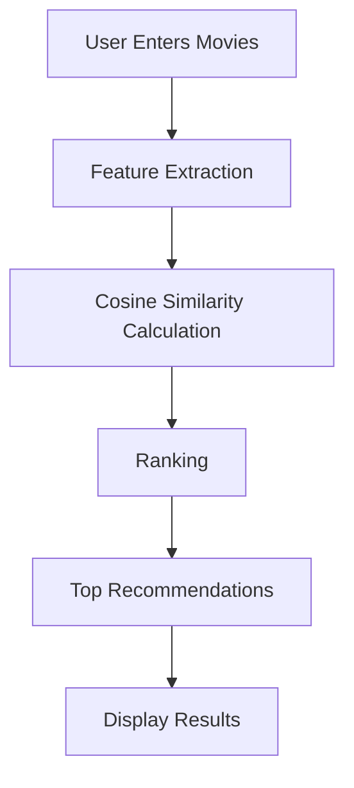

# 🎬 Web-Based Movie Recommendation System 🍿


---


## 🚀 About the Project

Welcome to our **Web-Based Movie Recommendation System**! This intelligent platform suggests movies based on your personal preferences. By entering movies you enjoy, our system uses cosine similarity to find and recommend similar films you're likely to love.


### 🧠 Core Technologies


## ✨ Key Features

- 🌐 **Web-Based Interface**: Easy-to-use platform for entering your favorite movies.
- 🔍 **Content-Based Filtering**: Recommendations based on movie features, not just user ratings.
- 📊 **Cosine Similarity**: Advanced algorithm to find truly similar movies.
- 🗃️ **Extensive Movie Database**: Large collection of movies with detailed features.
- 🚀 **Fast Processing**: Quick recommendations thanks to efficient algorithms.
- 📱 **Responsive Design**: Works seamlessly on both desktop and mobile devices.


## 💻 How It Works

1. **User Input**: Enter movies you like through the web interface.
2. **Feature Extraction**: System extracts relevant features from the entered movies.
3. **Similarity Calculation**: Cosine similarity is computed between the input movies and our database.
4. **Ranking**: Movies are ranked based on their similarity scores.
5. **Recommendation**: Top similar movies are presented as recommendations.



## 🚀 Getting Started

1. **Clone the repository:**
   ```bash
   git clone https://github.com/Sahil-git1/movies-recommendation-system.git
   ```

2. **Install dependencies:**
   ```bash
   pip install -r requirements.txt
   ```

3. **Set up the database:**
   ```bash
   python setup_database.py
   ```

4. **Run the Flask application:**
   ```bash
   python app.py
   ```

5. **Open your browser and navigate to `http://localhost:5000`**


## 🧠 Technical Architecture

- **Frontend**: HTML, CSS, JavaScript
- **Backend**: Flask (Python web framework)
- **Recommendation Engine**: Scikit-learn for cosine similarity calculations
- **Natural Language Processing**: NLTK for text processing of movie descriptions


## 🛠️ Built With

- [Flask](https://flask.palletsprojects.com/) - Web framework
- [Scikit-learn](https://scikit-learn.org/) - Machine learning library
- [NLTK](https://www.nltk.org/) - Natural Language Toolkit
- [SQLite](https://www.sqlite.org/) - Database engine
- [Bootstrap](https://getbootstrap.com/) - Frontend framework

## 🤝 Contributing

We welcome contributions! Here's how you can help:

1. 🍴 Fork the repository
2. 🌿 Create your feature branch (`git checkout -b feature/AmazingFeature`)
3. 💾 Commit your changes (`git commit -m 'Add some AmazingFeature'`)
4. 📤 Push to the branch (`git push origin feature/AmazingFeature`)
5. 🔃 Open a Pull Request


